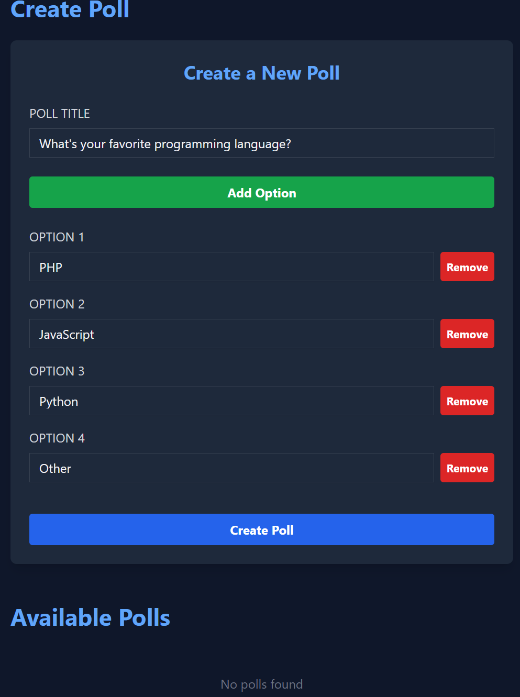
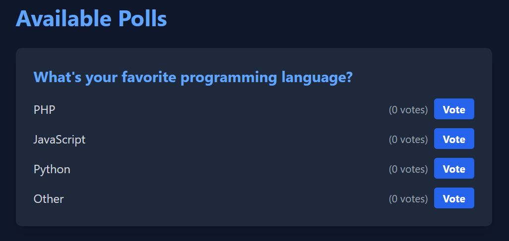
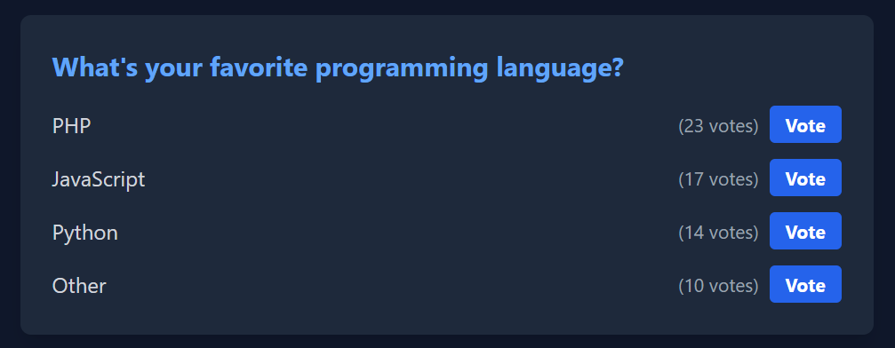
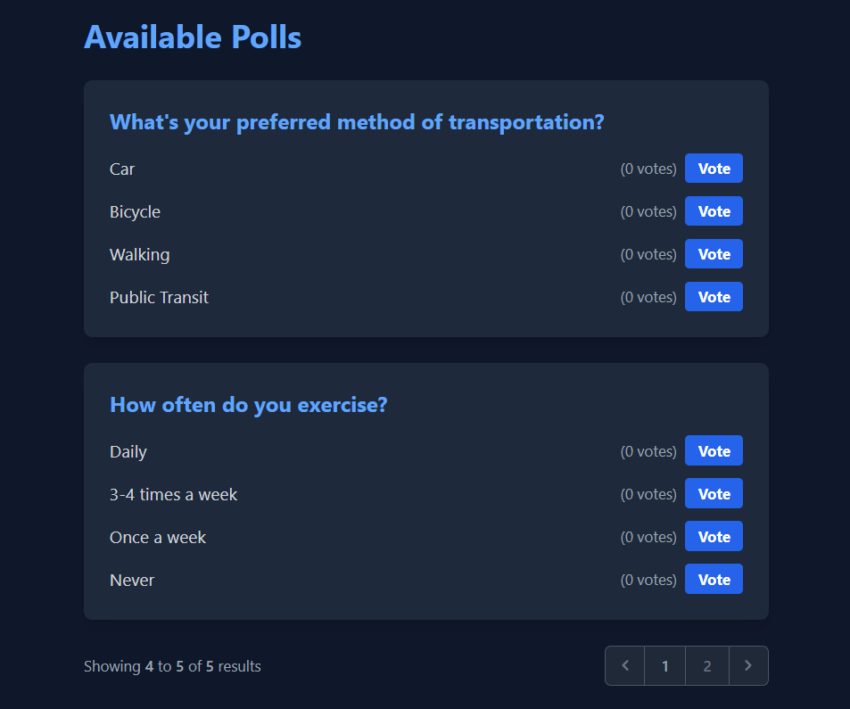
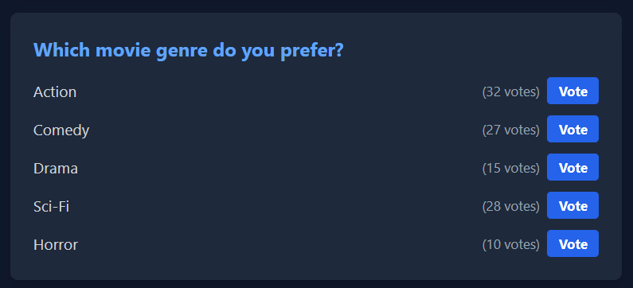
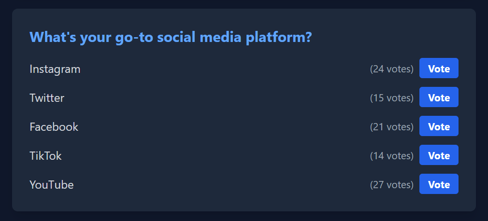

<p align="center"><a href="https://laravel.com" target="_blank"></a></p>

# PollCraft: Craft Your Questions, Get Your Answers

PollCraft is a dynamic, real-time polling application built with Laravel and Livewire. It allows users to create polls instantly and gather responses in real-time.

## Features

- Create polls with multiple options
- Real-time voting
- Instant results update
- Responsive design for mobile and desktop

## Technologies Used

- Laravel 10
- Livewire 3
- Tailwind CSS
- MySQL

## Usage

### Creating a Poll

1. Enter your poll question in the "Poll Title" field
2. Add options for your poll using the "Add Option" button
3. Click "Create Poll" to publish your poll



### Voting on a Poll

1. Scroll down to the "Available Polls" section
2. Find the poll you want to vote on
3. Click the "Vote" button next to your chosen option



### Viewing Results

Results are updated in real-time as votes are cast. The number of votes for each option is displayed next to the option.



### Pagination

PollCraft uses pagination to manage large numbers of polls efficiently. Navigate through pages of polls using the pagination controls at the bottom of the Available Polls section.



## Example Polls

Here are some example polls created with PollCraft:

1. Favorite Programming Language Poll
2. Movie Genre Preference Poll
3. Social Media Platform Preference Poll

<div style="display: flex; justify-content: space-between; flex-wrap: wrap;">
  
  
  
</div>

## Installation

1. Clone the repository
   ```
   git clone https://github.com/yourusername/pollcraft.git
   ```
2. Navigate to the project directory
   ```
   cd pollcraft
   ```
3. Install PHP dependencies
   ```
   composer install
   ```
4. Install NPM dependencies
   ```
   npm install
   ```
5. Create a copy of your .env file
   ```
   cp .env.example .env
   ```
6. Generate an app encryption key
   ```
   php artisan key:generate
   ```
7. Create an empty database for our application
8. In the .env file, add database information to allow Laravel to connect to the database
9. Migrate the database
   ```
   php artisan migrate
   ```
10. Seed the database (optional)
    ```
    php artisan db:seed
    ```
11. Start the local development server
    ```
    php artisan serve
    ```

You can now access the server at http://localhost:8000

## Contributing

Contributions are welcome! Please feel free to submit a Pull Request.

## License

This project is open-sourced software licensed under the [MIT license](https://opensource.org/licenses/MIT).
